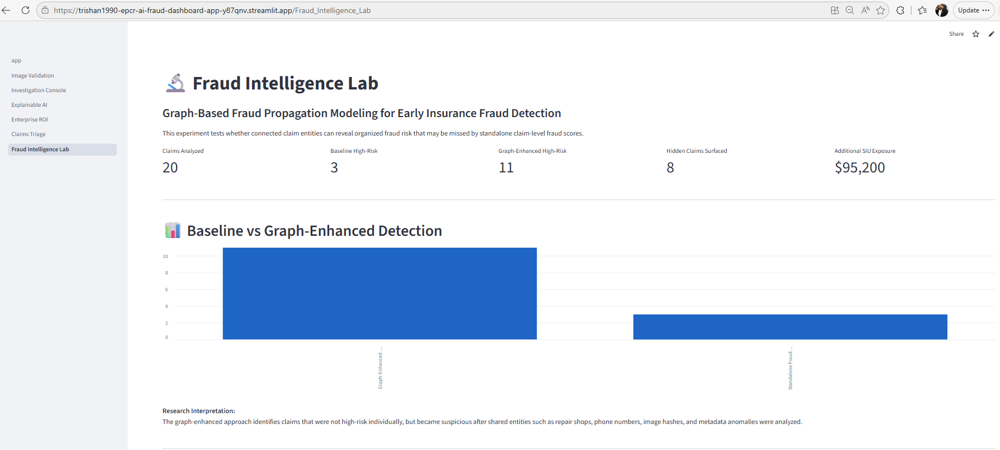
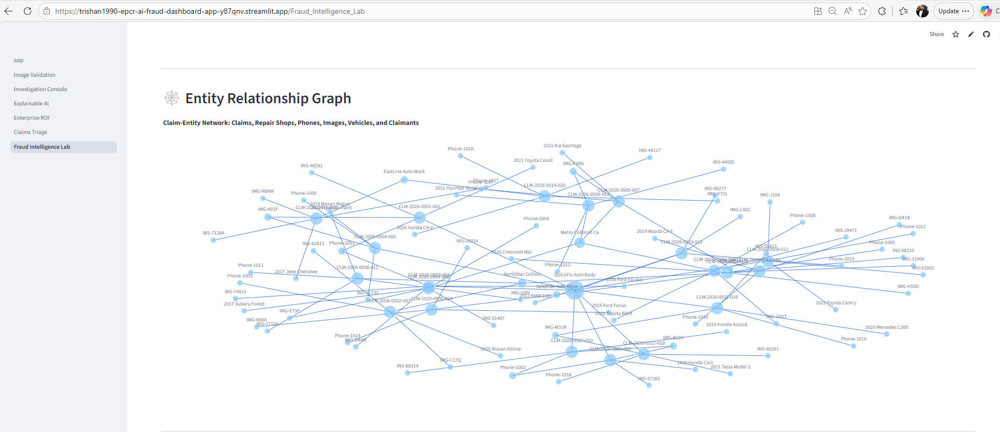
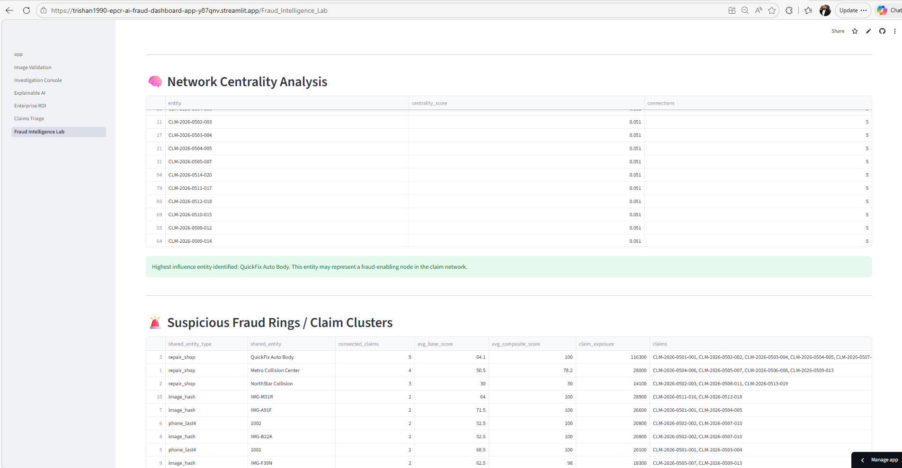
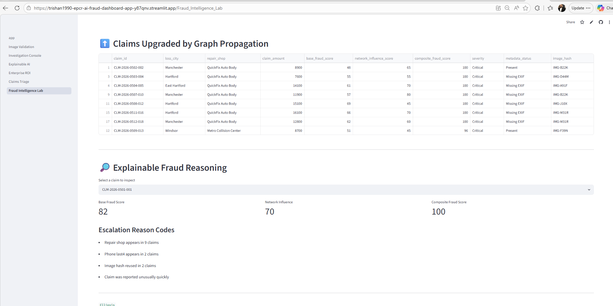
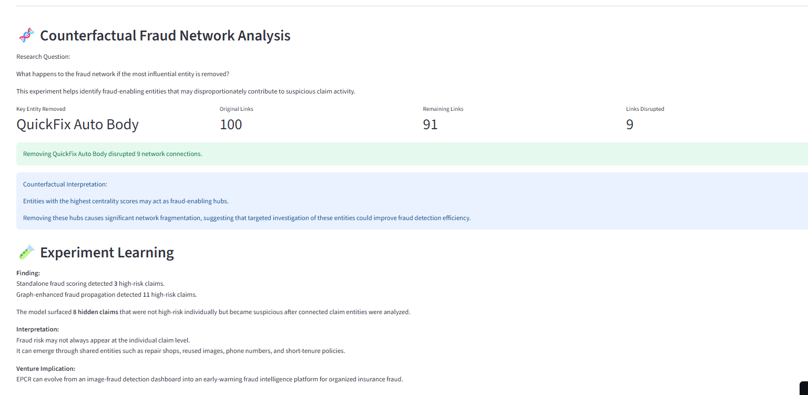

# EPCR AI – Experiment Log #004

## Graph-Based Fraud Propagation Modeling for Early Insurance Fraud Detection

### Objective

Evaluate whether graph-based fraud propagation can identify hidden fraud relationships and organized fraud activity that may not be visible through standalone claim-level fraud scoring.

---

## Research Question

Can connected claim entities reveal organized fraud risk earlier than individual claim-level fraud scores?

---

## Hypothesis

If claims share common entities such as repair shops, phone numbers, image hashes, or claimant relationships, then graph-based fraud propagation can identify additional high-risk claims that would otherwise remain below investigation thresholds.

---

## What Was Built

A new **Fraud Intelligence Lab** module was added to the EPCR AI platform containing:

* Graph-Based Fraud Propagation Engine
* Entity Relationship Network Visualization
* Network Centrality Analysis
* Fraud Ring Detection
* Explainable Fraud Reasoning
* Counterfactual Fraud Analysis

---

## Dataset

A synthetic but realistic auto-insurance claims dataset was created using:

* Claim Information
* Vehicle Information
* Repair Shops
* Claim Amounts
* Image Hashes
* Metadata Status
* Fraud Risk Scores

Controlled fraud-ring patterns were intentionally introduced to evaluate network-based fraud detection techniques.

---

## Experiment Design

### Baseline Detection

Claims flagged using:

```text
Fraud Score >= 70
```

### Graph-Enhanced Detection

Additional risk signals included:

* Shared Repair Shops
* Shared Phone Numbers
* Reused Images
* Missing Metadata
* Short Policy Tenure
* Rapid Claim Reporting

---

## Results

| Metric                          | Value              |
| ------------------------------- | ------------------ |
| Claims Analyzed                 | 20                 |
| Baseline High-Risk Claims       | 3                  |
| Graph-Enhanced High-Risk Claims | 11                 |
| Hidden Claims Surfaced          | 8                  |
| Additional SIU Exposure         | $102,800           |
| Potential Fraud Hub Identified  | QuickFix Auto Body |

---

## Key Finding

Graph-enhanced fraud propagation increased identified high-risk claims from **3 to 11 claims** and surfaced **8 previously hidden claims** connected through shared entities and fraud-ring relationships.

---

## Screenshots

### KPI Dashboard



### Entity Relationship Graph



### Network Centrality Analysis



### Fraud Ring Detection



### Counterfactual Fraud Analysis



---

## Venture Learning

Fraud risk is not always visible at the individual claim level.

The experiment demonstrated that hidden fraud relationships can emerge through connected entities such as repair shops, phone numbers, image hashes, and claimant relationships.

Graph analytics may therefore provide insurers with earlier visibility into organized fraud activity and improve investigator prioritization workflows.

---

## Responsible AI Considerations

* Human-in-the-loop decision making
* Explainable fraud reasoning
* No automated claim denial
* Transparent escalation logic
* Investigator oversight maintained throughout workflow

---

## Decision

### Continue

The venture will continue exploring fraud intelligence capabilities and investigator decision-support workflows.

Future experiments will focus on:

* Investigator Validation Studies
* Claims Adjuster User Testing
* AI-Generated Damage Detection
* Enterprise Fraud Intelligence Workflows

---

## Conclusion

This experiment successfully demonstrated the feasibility of graph-based fraud propagation modeling for insurance fraud detection.

The EPCR AI platform evolved from an image-fraud detection prototype into an early-warning fraud intelligence system capable of identifying hidden relationships and supporting more effective fraud investigations.
